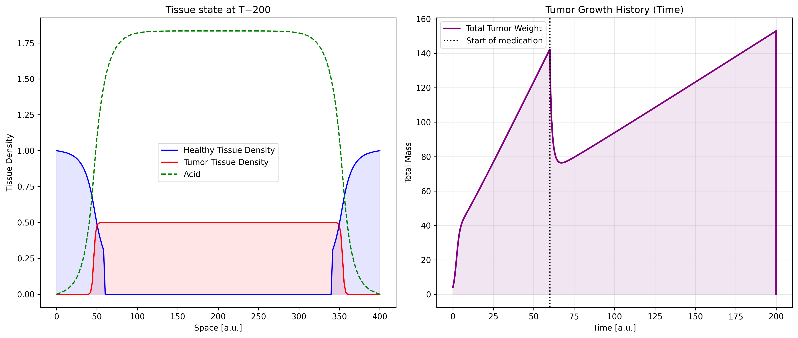
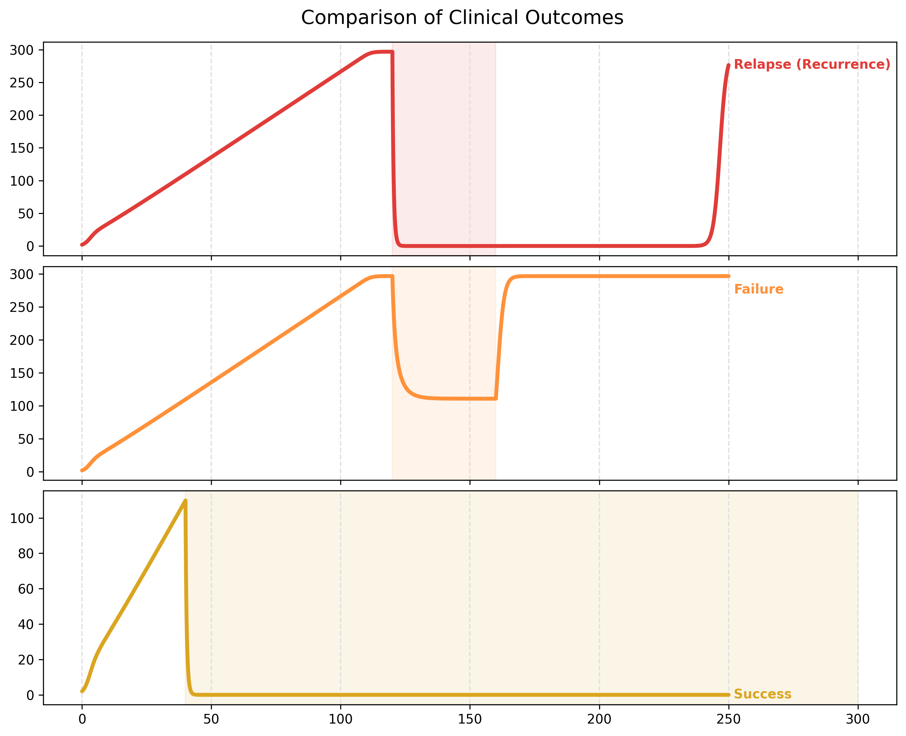

# Acid-Mediated-Tumor-Invasion-Model
Acid-Mediated Tumor Invasion Mathematical Model Created in Python.
# Glioma growth and treatment simulation
A mathematical simulation of Glioma growth and treatment response, developed in Python.
This project is based on the seminal paper **"A Reaction-Diffusion Model of Cancer Invasion"** by Robert A. Gatenby and Edward T. Gawlinski.

The simulation was built in three evolutionary stages to progressively model the complexity of tumor dynamics.

##Project evolution
### Phase 1: Temporal Dynamics (ODE)
I started by modeling the population growth over time using the **Logistic Growth Equation**.
* *Goal:* Understand carrying capacity and basic growth limits.
*  *Mathematics:*Ordinary Differential Equations (ODE) computed using Euler's method.

*(Fig1. Temporal evolution of tumor density $u(t)$. The curve demonstrates initial logistic growth reaching carrying capacity, followed by a rapid decline to zero induced by the simulated treatment.)*
---
### Phase 2: Spatiotemporal Dynamics (PDE)
I introduced space into the model using the *Fisher-Kolmogorov Equation* (Reaction-Diffusion).
* *Goal:* Simulate how the tumor (and acidity) spreads into physical space
*  *Mathematics:* Partial Differential Equations (PDE) solved via Finite Difference Method.

*(Fig 2. Spatiotemporal profile of the tumor. The wavefront represents the "traveling wave" of cancer cells invading healthy tissue (rightward propagation) driven by the diffusion gradient.)*
---
### Phase 3: Clinical Simulation
The final model incorporates **chemotherapy, drug resistance, and relapse mechanisms**.
My goal was to demonstrate how changing two key parameters—**chemotherapy strength** and **duration of treatment**—drastically affects the clinical outcome.


*(Fig 3. Clinical trajectories showing total tumor mass over time. Note the distinct "U-shape" in the Relapse scenario (Red), where the tumor regrows after a period of apparent remission, contrasting with the Resistance/Failure scenario (Orange), where the tumor mass stabilizes but does not recede.)*

## Tech Stack 
* *Python 3.x*
* *NumPy* (Numerical computing)
* *Matplotlib* (Data visualization)

## How to Run
1. Clone the repository.
2. Install dependencies:
   ```bash
   pip install numpy matplotlib
